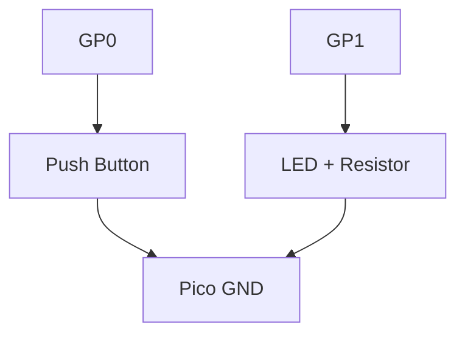

# Button Control Project

Learn how to read a digital input from a button and use it to control an LED.

## 1. Circuit Diagram
This circuit uses a "Pull-Up" configuration. The button connects the pin to Ground when pressed.



**Connections:**
- **Pico GP0** -> Button Pin 1
- **Button Pin 2** -> Pico GND
- **Pico GP1** -> Anode of LED (via Resistor)
- **LED Cathode** -> Pico GND

## 2. Code Implementation

### Pure JavaScript (`src/main.js`)
```javascript
import { Pin } from 'unisim';

const btn = new Pin('GP0');
const led = new Pin('GP1');

unisim.on('ready', () => {
    setInterval(() => {
        // Active Low: Button reads 0 when pressed
        if (btn.read() === 0) {
            led.write(1);
        } else {
            led.write(0);
        }
    }, 50);
});
```

### MicroPython (`<project-root>/modules/main.py`)
```python
from machine import Pin
import time

# Use PULL_UP to keep the pin High when button is NOT pressed
btn = Pin(0, Pin.IN, Pin.PULL_UP)
led = Pin(1, Pin.OUT)

while True:
    if not btn.value(): # 0 = Pressed
        led.on()
    else:
        led.off()
    time.sleep(0.05)
```

---
*View all [Project Examples](../projects.md)*
