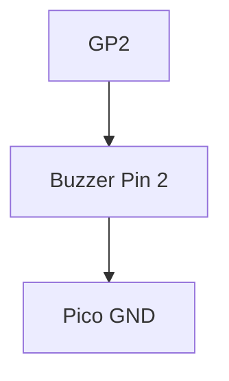

# Buzzer Alarm Project

Generate sound frequencies using Pulse Width Modulation (PWM).

## 1. Circuit Diagram
The buzzer is connected to a PWM-capable pin on the Pico.



**Connections:**
- **Pico GP2** -> Buzzer Positive (+)
- **Buzzer Negative (-)** -> Pico GND

## 2. Code Implementation

### Pure JavaScript (`src/main.js`)
```javascript
import { PWM, sleep } from 'unisim';

const buzzer = new PWM('GP2');

async function siren() {
    while (true) {
        buzzer.freq(2000); // High pitch
        buzzer.duty(512); 
        await sleep(500);
        
        buzzer.freq(1000); // Low pitch
        await sleep(500);
    }
}

unisim.on('ready', siren);
```

### MicroPython (`<project-root>/modules/main.py`)
```python
from machine import Pin, PWM
import time

buzzer = PWM(Pin(2))

while True:
    buzzer.freq(2000)
    buzzer.duty_u16(32768) # 50% duty
    time.sleep(0.5)
    
    buzzer.freq(1000)
    time.sleep(0.5)
```

---
*View all [Project Examples](../projects.md)*
