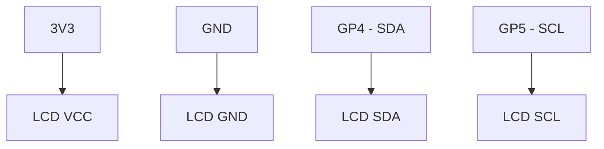

# I2C LCD Message Project

Display real-time data or custom messages on a 16x2 character screen using the I2C protocol.

## 1. Circuit Diagram
The LCD uses only 4 wires to communicate with the Pico.



**Connections:**
- **LCD VCC** -> Pico 3.3V
- **LCD GND** -> Pico GND
- **LCD SDA** -> Pico GP4
- **LCD SCL** -> Pico GP5

## 2. Code Implementation

### Pure JavaScript (`src/main.js`)
```javascript
import { I2C } from 'unisim';

// Note: Requires an LCD driver library in JS
// Contact UniSim Support for the latest LCD.js module
const i2c = new I2C('GP4', 'GP5');
```

### MicroPython (`<project-root>/modules/main.py`)
```python
from machine import Pin, I2C, I2cLcd
import time

i2c = I2C(0, sda=Pin(4), scl=Pin(5))
lcd = I2cLcd(i2c, 0x27, 2, 16)

lcd.putstr("UniSim Dashboard\n")
lcd.putstr("Ready to Work!")

while True:
    time.sleep(1)
```

---
*View all [Project Examples](../projects.md)*
