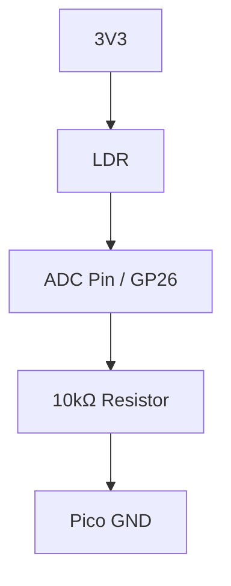

# LDR Light Sensor Project

Measure environmental light levels and respond to shadows or brightness.

## 1. Circuit Diagram
The LDR is part of a voltage divider connected to an Analog-to-Digital Converter (ADC) pin.



**Connections:**
- **Pico 3.3V** -> LDR Pin 1
- **LDR Pin 2** -> Pico GP26 (ADC0)
- **Pico GP26** -> 10kΩ Resistor Pin 1
- **Resistor Pin 2** -> Pico GND

## 2. Code Implementation

### Pure JavaScript (`src/main.js`)
```javascript
import { Pin } from 'unisim';

const ldr = new Pin('GP26');

unisim.on('ready', () => {
    setInterval(() => {
        const light = ldr.readAnalog(); // Value between 0 and 1023
        console.log(`Light Level: ${light}`);
    }, 500);
});
```

### MicroPython (`<project-root>/modules/main.py`)
```python
from machine import ADC, Pin
import time

ldr = ADC(Pin(26))

while True:
    value = ldr.read_u16() # Range 0-65535
    print(f"LDR Value: {value}")
    time.sleep(0.5)
```

---
*View all [Project Examples](../projects.md)*
