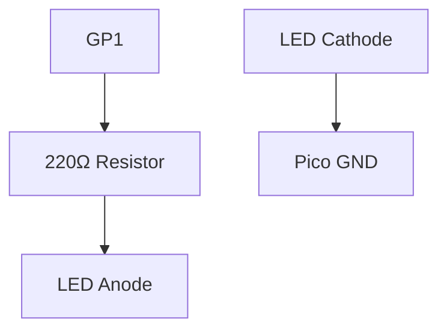

# LED Blink Project

This project demonstrates the most basic interaction in UniSim: controlling a digital output pin to blink an LED.

## 1. Circuit Diagram
The circuit consists of a Raspberry Pi Pico, a Red LED, and a 220Ω Resistor for safety.



**Connections:**
- **Pico GP1** -> Resistor Pin 1
- **Resistor Pin 2** -> LED Anode (Long leg)
- **LED Cathode** -> Pico GND

## 2. Code Implementation

### Pure JavaScript (`src/main.js`)
```javascript
import { Pin, sleep } from 'unisim';

const led = new Pin('GP1');

async function blink() {
    while (true) {
        led.write(1); // ON
        await sleep(1000);
        led.write(0); // OFF
        await sleep(1000);
    }
}

unisim.on('ready', blink);
```

### MicroPython (`<project-root>/modules/main.py`)
```python
from machine import Pin
import time

led = Pin(1, Pin.OUT)

while True:
    led.on()
    time.sleep(1)
    led.off()
    time.sleep(1)
```

---
*View all [Project Examples](../projects.md)*
