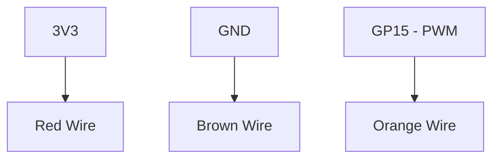

# Servo Sweep Project

Control a servo motor's position using precise PWM duty cycles.

## 1. Circuit Diagram
Servos generally have three wires: Power, Ground, and Signal.



**Connections:**
- **Servo Red (VCC)** -> Pico 3.3V
- **Servo Brown (GND)** -> Pico GND
- **Servo Orange (SIG)** -> Pico GP15

## 2. Code Implementation

### Pure JavaScript (`src/main.js`)
```javascript
import { PWM, sleep } from 'unisim';

const servo = new PWM('GP15');
servo.freq(50); // Servo standard frequency

async function sweep() {
    while (true) {
        servo.duty(25);  // 0 degrees
        await sleep(1000);
        servo.duty(123); // 180 degrees
        await sleep(1000);
    }
}

unisim.on('ready', sweep);
```

### MicroPython (`<project-root>/modules/main.py`)
```python
from machine import Pin, PWM
import time

servo = PWM(Pin(15))
servo.freq(50)

while True:
    servo.duty_u16(1638)  # 0 degrees
    time.sleep(1)
    servo.duty_u16(8192)  # 180 degrees
    time.sleep(1)
```

---
*View all [Project Examples](../projects.md)*
