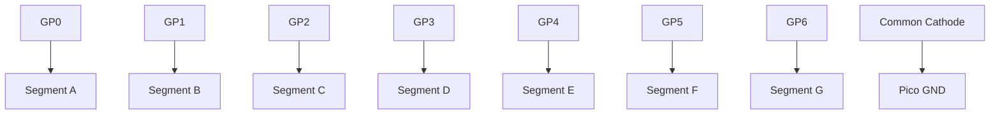

# Seven-Segment Display Project

Learn how to control individual LEDs within a single package to display numbers.

## 1. Circuit Diagram
Each segment (labeled A through G) is connected to a separate GP pin on the Pico.



**Connections:**
- Connect **GP0 through GP6** to the respective segment pins via current-limiting resistors.
- Connect the **Common Pin** to Pico GND.

## 2. Code Implementation

### Pure JavaScript (`src/main.js`)
```javascript
import { Pin } from 'unisim';

const segments = [
    new Pin('GP0'), new Pin('GP1'), new Pin('GP2'), 
    new Pin('GP3'), new Pin('GP4'), new Pin('GP5'), new Pin('GP6')
];

// Display the number '1' (using segments B and C)
unisim.on('ready', () => {
    segments[1].write(1);
    segments[2].write(1);
});
```

### MicroPython (`<project-root>/modules/main.py`)
```python
from machine import Pin

pins = [Pin(i, Pin.OUT) for i in range(7)]

# Display '1' (GP1 and GP2 high)
pins[1].on()
pins[2].on()
```

---
*View all [Project Examples](../projects.md)*
