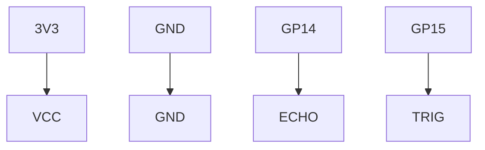

# Ultrasonic Distance Project

Use sound waves to detect objects and measure distances without touch.

## 1. Circuit Diagram
The sensor requires a Trigger signal and provides an Echo pulse.



**Connections:**
- **HC-SR04 VCC** -> Pico 3.3V
- **HC-SR04 GND** -> Pico GND
- **HC-SR04 Echo** -> Pico GP14
- **HC-SR04 Trig** -> Pico GP15

## 2. Code Implementation

### Pure JavaScript (`src/main.js`)
```javascript
import { Pin, HCSR04, sleep } from 'unisim';

const echo = new Pin('GP14');
const trig = new Pin('GP15');
const sensor = new HCSR04(trig, echo);

async function monitor() {
    while (true) {
        const dist = await sensor.distance_cm();
        console.log(`Object at: ${dist} cm`);
        await sleep(1000);
    }
}

unisim.on('ready', monitor);
```

### MicroPython (`<project-root>/modules/main.py`)
```python
from machine import Pin, HCSR04
import time

echo = Pin(14, Pin.IN)
trig = Pin(15, Pin.OUT)
sensor = HCSR04(trig, echo)

while True:
    dist = sensor.distance_cm()
    print(f"Distance: {dist} cm")
    time.sleep(1)
```

---
*View all [Project Examples](../projects.md)*
